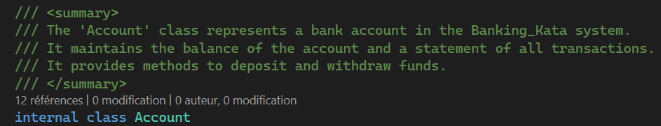
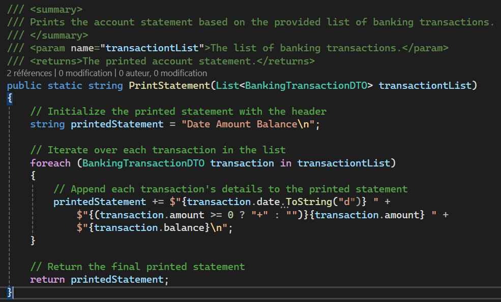

# Challenge instructions for `/doc` command

## Step 1: Add comment on class

1. Open `Account.cs` file.
2. Use CTRL+A to select all the content in the file
3. Type `/doc` to add comments
4. Select only the classname in `BankingTransactionDTO.cs`
5. Type `/doc` to add comments

### Observations

Comments are created for all the methods of the class

There is not always a comment on the top of the class name
There should not have a comment on Account.cs

## Step 2: Use Copilot Chat to have a complete comment on class name

1. Open Copilot Chat to generate a comment on top of the class
2. `#Account.cs Give me a comment to descript the class Account`
3. Ask for a smaller or longer comment

### Observations

You can generate a complete comment and reduce it.
Copilot keep the context of the previous question.

## Step 3: Add comments to a test method

1. Open `AccountTest.cs` file.
2. Select the method WhenAWithdrawAfterDepositIsDone_BankAccountShouldBeEqualToDepositMinusWithDrawAndStatementUpdated and type `/doc`
3. Rename the mehtod WhenAWithdrawAfterDepositIsDone_BankAccountShouldBeUpdated and type `/doc`

### Observations

Comments are generated from the method name

Your code needs to be descriptive to generate good comments

## Step 4: Add comments inside a method

1. Open Copilot Chat and type the command below
2. `#AccountStatementPrint.cs Add comment for each statement in PrintStatement`

### Observations

You can generate documentation inside complexe methods

## Step 5: Create a README.md

1. In Visual Studio Code, create a file README.md at the root of the project
2. Type in Copilot Chat `Create me a template of README.md`
3. Add precision to the comment with `Create me a template of README.md for .NET 8 project`
4. Accept the template and open Github Copilot Chat
5. Type `@workspace Create a small description for the Banking Kata project`

### Observations

You can generate global documentation for a project

## Step 6: Improve your documentation

1. Ask Github Copilot to improve your RAEDME.me file
2. `What should I include in README.md file to a .NET 8 project ?`

### Observations

Github Copilot suggests more sections