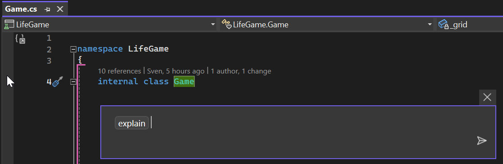
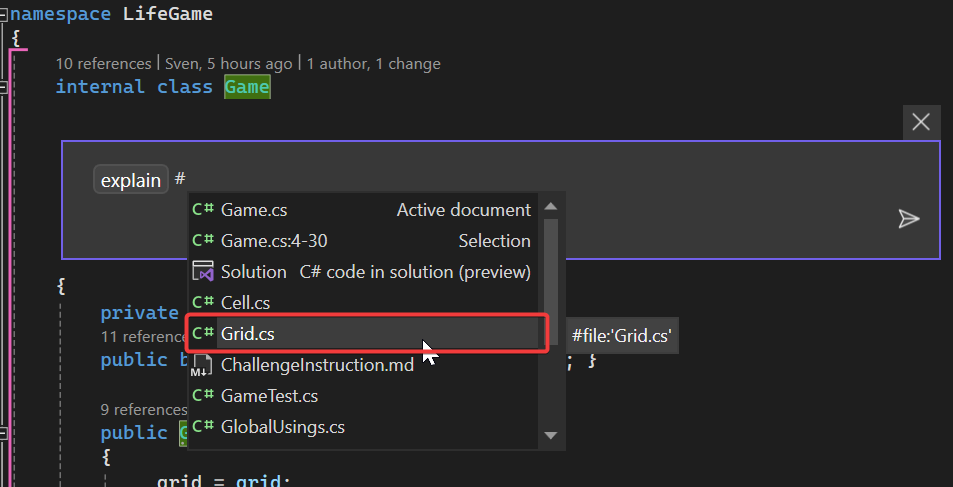
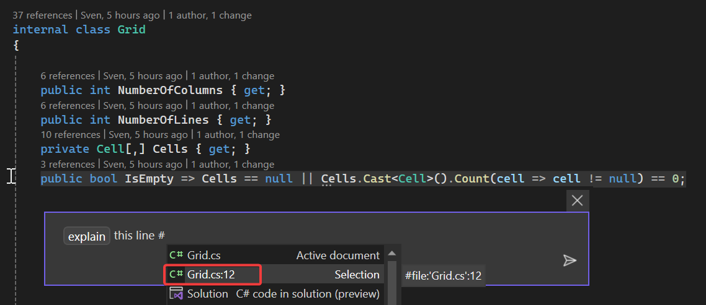

# Challenge instructions for `/explain` command
## Step 1: On the main file
### Instructions

1. Open the `game.cs` file.
2. Press `alt + :`.
3. Type `/explain` and press enter.

### Observations

To notice:
1. Copilot described the entire class.
2. You can have access to the references used in the input prompt. Notice that only the open file was used.
3. Check the explanations and see if they fit with the code you are reading.

## Step 2: On multiple files
### Instructions

*Open a new chat.*

You can ask Copilot to take further files into account using `#` inside the chat.

### Observations

To notice:
1. This time only the specified file was taken into account.
2. Compare the result with the previous answer which used only `game.cs`.

## Step 3: On code section exclusively
### Instructions
*Open a new chat.*
1. Open the file `grid.cs`.
2. Select the line 12 containing a lambda expression.
3. Press `alt + :` and enter `/explain` followed by `#` and click on the option `'Grid.cs':12` to only consider line 12.

### Observations

Redo the same experience, this time only using the command `/explain` and compare the results.

Make the same steps on ``IsFull``, which is a more complicated expression.