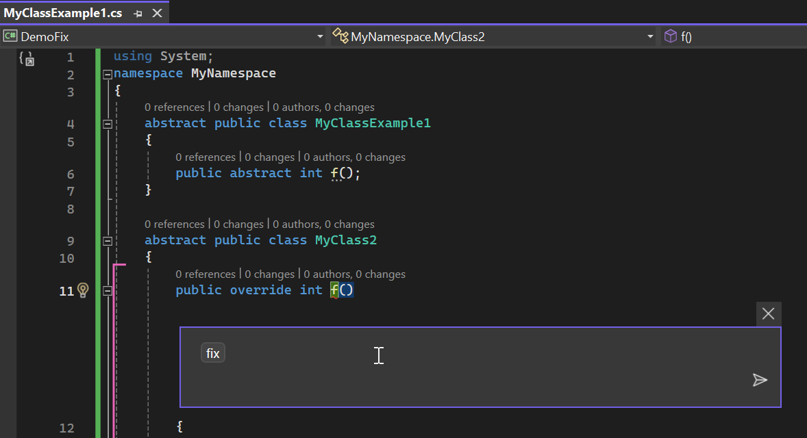

[Version française disponible plus bas](#version-française)

# Challenge instructions for `/fix` command

## Step 1 : Fix `MyClassExample1.cpp`

1. Open the `MyClassExample1.cpp` file in the `DemoFix` solution.
2. Press `alt + :` and type `/fix` before pressing enter. 
3. Check if the proposed solution is aligned with the [Solution 1](https://learn.microsoft.com/en-us/cpp/error-messages/compiler-errors-1/compiler-error-c2143)

## Step 2 : Fix other classes

Follow same instructions and check if Copilot gave correct answers. 

## Step 3

1. Open `Program.cpp` file
2. Launch the Run method from Program
3. You should notice an execution error
4. Analyze this error with the shortcut `Ask Copilot`

5. Change the value of MaxPath to 2048
6. Notice that one last error remains
7. Fix this error with /fix

# Version française

# Instructions de défi pour la commande `/fix`

## Étape 1 : Corriger `MyClassExample1.cpp`

1. Ouvrez le fichier `MyClassExample1.cpp` dans la solution `DemoFix`.
2. Appuyez sur `alt + :` et tapez `/fix` avant d'appuyer sur Entrée. 
3. Vérifiez si la solution proposée est alignée avec la [Solution 1](https://learn.microsoft.com/en-us/cpp/error-messages/compiler-errors-1/compiler-error-c2143)

## Étape 2 : Corriger d'autres classes

Suivez les mêmes instructions et vérifiez si Copilot a donné les bonnes réponses. 

## Étape 3

1. Ouvrez le fichier `Program.cpp`
2. Lancez la méthode Run depuis Program
3. Vous devriez remarquer une erreur d'exécution
4. Analysez cette erreur avec le raccourci `Ask Copilot`

5. Changez la valeur de MaxPath à 2048
6. Remarquez qu'une dernière erreur persiste
7. Corrigez cette erreur avec /fix
