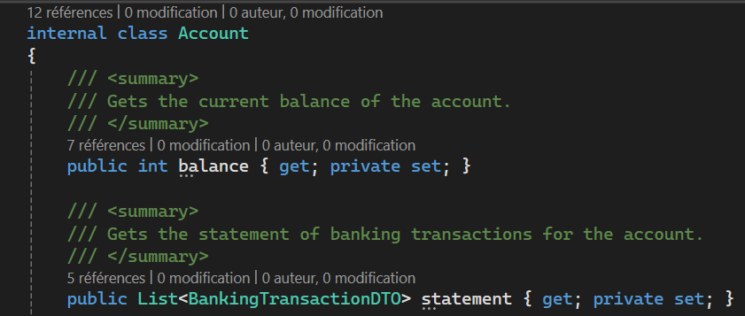
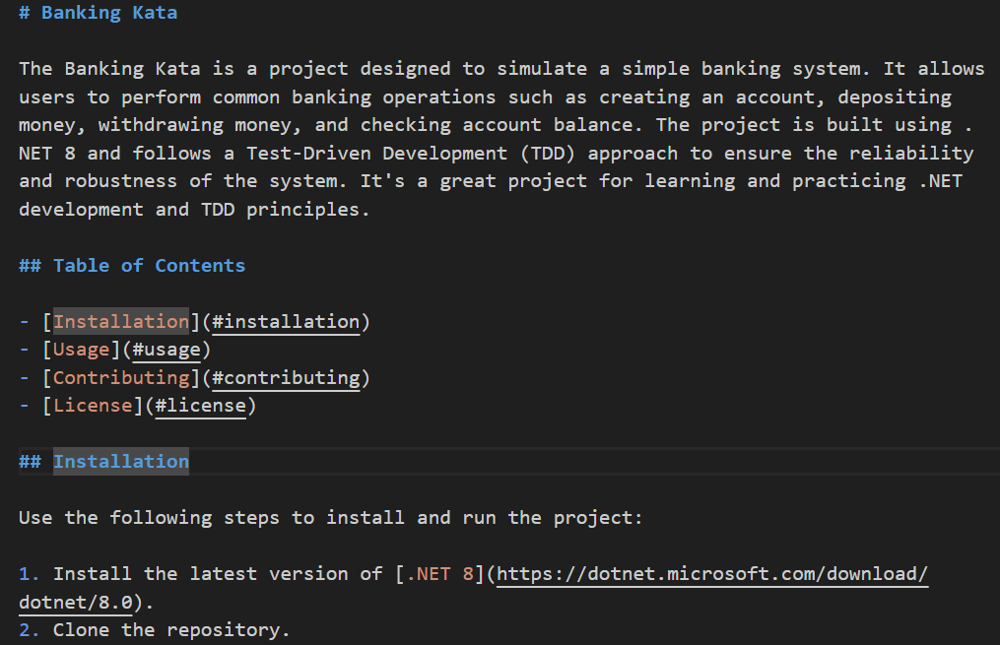

[Version française disponible plus bas](#version-française)

# Challenge instructions for `/doc` command

## Step 1: Add comment on class

1. Open `Account.cs` file.
2. Use CTRL+A to select all the content in the file
3. Type `/doc` to add comments
4. Select only the classname in `BankingTransactionDTO.cs`
5. Type `/doc` to add comments

### Observations

Comments are created for all the methods of the class

There is not always a comment on the top of the class name
There should not have a comment on Account.cs

## Step 2: Use Copilot Chat to have a complete comment on class name

1. Open Copilot Chat to generate a comment on top of the class
2. `#Account.cs Give me a comment to describe the class Account`
3. Ask for a smaller or longer comment

### Observations

You can generate a complete comment and reduce it.
Copilot keeps the context of the previous question.

## Step 3: Add comments to a test method

1. Open `AccountTest.cs` file.
2. Select the method WhenAWithdrawAfterDepositIsDone_BankAccountShouldBeEqualToDepositMinusWithdrawAndStatementUpdated and type `/doc`
3. Rename the method WhenAWithdrawAfterDepositIsDone_BankAccountShouldBeUpdated and type `/doc`

### Observations

Comments are generated from the method name

Your code needs to be descriptive to generate good comments

## Step 4: Add comments inside a method

1. Open Copilot Chat and type the command below
2. `#AccountStatementPrint.cs Add comment for each statement in PrintStatement`

### Observations

You can generate documentation inside complex methods

## Step 5: Create a README.md

1. In Visual Studio Code, create a file README.md at the root of the project
2. Type in Copilot Chat `Create me a template of README.md`
3. Add precision to the comment with `Create me a template of README.md for .NET 8 project`
4. Accept the template and open GitHub Copilot Chat
5. Type `@workspace Create a small description for the Banking Kata project`

### Observations

You can generate global documentation for a project

## Step 6: Improve your documentation

1. Ask GitHub Copilot to improve your README.md file
2. `What should I include in README.md file for a .NET 8 project?`

### Observations

GitHub Copilot suggests more sections

# Version française

# Instructions de défi pour la commande `/doc`

## Étape 1 : Ajouter un commentaire sur la classe

1. Ouvrez le fichier `Account.cs`.
2. Utilisez CTRL+A pour sélectionner tout le contenu du fichier
3. Tapez `/doc` pour ajouter des commentaires
4. Sélectionnez uniquement le nom de la classe dans `BankingTransactionDTO.cs`
5. Tapez `/doc` pour ajouter des commentaires

### Observations

Les commentaires sont créés pour toutes les méthodes de la classe

Il n'y a pas toujours de commentaire en haut du nom de la classe
Il ne devrait pas y avoir de commentaire sur Account.cs

## Étape 2 : Utiliser Copilot Chat pour obtenir un commentaire complet sur le nom de la classe

1. Ouvrez Copilot Chat pour générer un commentaire en haut de la classe
2. `#Account.cs Donne-moi un commentaire pour décrire la classe Account`
3. Demandez un commentaire plus court ou plus long

### Observations

Vous pouvez générer un commentaire complet et le réduire.
Copilot garde le contexte de la question précédente.

## Étape 3 : Ajouter des commentaires à une méthode de test

1. Ouvrez le fichier `AccountTest.cs`.
2. Sélectionnez la méthode WhenAWithdrawAfterDepositIsDone_BankAccountShouldBeEqualToDepositMinusWithdrawAndStatementUpdated et tapez `/doc`
3. Renommez la méthode WhenAWithdrawAfterDepositIsDone_BankAccountShouldBeUpdated et tapez `/doc`

### Observations

Les commentaires sont générés à partir du nom de la méthode

Votre code doit être descriptif pour générer de bons commentaires

## Étape 4 : Ajouter des commentaires à l'intérieur d'une méthode

1. Ouvrez Copilot Chat et tapez la commande ci-dessous
2. `#AccountStatementPrint.cs Ajoutez un commentaire pour chaque instruction dans PrintStatement`

### Observations

Vous pouvez générer de la documentation à l'intérieur de méthodes complexes

## Étape 5 : Créer un README.md

1. Dans Visual Studio Code, créez un fichier README.md à la racine du projet
2. Tapez dans Copilot Chat `Créez-moi un modèle de README.md`
3. Ajoutez des précisions au commentaire avec `Créez-moi un modèle de README.md pour un projet .NET 8`
4. Acceptez le modèle et ouvrez GitHub Copilot Chat
5. Tapez `@workspace Créez une petite description pour le projet Banking Kata`

### Observations

Vous pouvez générer une documentation globale pour un projet

## Étape 6 : Améliorer votre documentation

1. Demandez à GitHub Copilot d'améliorer votre fichier README.md
2. `Que devrais-je inclure dans le fichier README.md pour un projet .NET 8 ?`

### Observations

GitHub Copilot suggère plus de sections