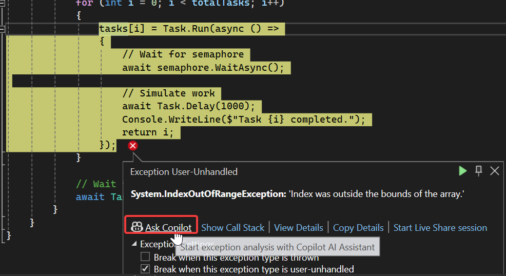

[Version française disponible plus bas](#version-française)

# Challenge instructions for `/fix` command

## Step 1: Fix `MyClassExample1.cs`

1. Open the `MyClassExample1.cs` file in the `DemoFix` solution.
2. Press `alt + :` and type `/fix` before pressing enter.
3. Check if the proposed solution is aligned with the [Solution 1](https://learn.microsoft.com/en-us/dotnet/csharp/language-reference/compiler-messages/cs0115)

## Step 2: Fix other classes

Follow the same instructions and check if Copilot gave correct answers.

| Class name       | Solution link |
|------------------|---------------|
| MyClassExample2  | [Solution 2](https://learn.microsoft.com/en-us/dotnet/csharp/language-reference/compiler-messages/cs0120) |
| MyClassExample3  | [Solution 3](https://learn.microsoft.com/en-us/dotnet/csharp/language-reference/compiler-messages/cs0134) |
| MyClassExample4  | [Solution 4](https://learn.microsoft.com/en-us/dotnet/csharp/language-reference/compiler-messages/cs0229) |

## Step 3

1. Open `MyClassExample5.cs` file
2. Fix the compilation error with /fix
3. Launch the Run method from Program
4. You should notice an execution error
5. Fix this error with the shortcut `Ask Copilot`

6. Only 2 tasks are executed instead of 10 as expected
7. Fix this error with /fix to execute the 10 tasks

# Version française

# Instructions de défi pour la commande `/fix`

## Étape 1 : Corriger `MyClassExample1.cs`

1. Ouvrez le fichier `MyClassExample1.cs` dans la solution `DemoFix`.
2. Appuyez sur `alt + :` et tapez `/fix` avant d'appuyer sur Entrée.
3. Vérifiez si la solution proposée est alignée avec la [Solution 1](https://learn.microsoft.com/en-us/dotnet/csharp/language-reference/compiler-messages/cs0115)

## Étape 2 : Corriger d'autres classes

Suivez les mêmes instructions et vérifiez si Copilot a donné les bonnes réponses.

| Nom de la classe | Lien de la solution |
|------------------|---------------------|
| MyClassExample2  | [Solution 2](https://learn.microsoft.com/en-us/dotnet/csharp/language-reference/compiler-messages/cs0120) |
| MyClassExample3  | [Solution 3](https://learn.microsoft.com/en-us/dotnet/csharp/language-reference/compiler-messages/cs0134) |
| MyClassExample4  | [Solution 4](https://learn.microsoft.com/en-us/dotnet/csharp/language-reference/compiler-messages/cs0229) |

## Étape 3

1. Ouvrez le fichier `MyClassExample5.cs`
2. Corrigez l'erreur de compilation avec /fix
3. Lancez la méthode Run depuis Program
4. Vous devriez remarquer une erreur d'exécution
5. Corrigez cette erreur avec le raccourci `Ask Copilot`

6. Seulement 2 tâches sont exécutées au lieu de 10 comme prévu
7. Corrigez cette erreur avec /fix pour exécuter les 10 tâches
