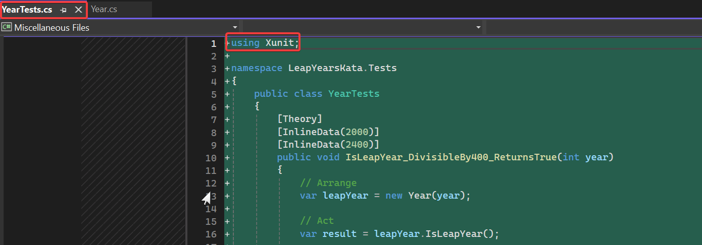
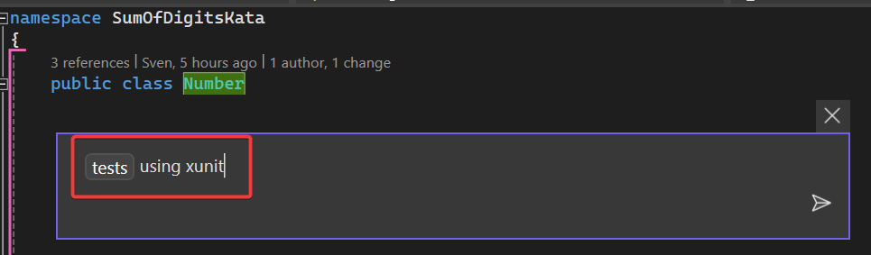

# Challenge instructions for `/tests` command

[Version française disponible plus bas](#instructions-en-français)

## Step 1: Generate tests for `Year.cs`

### Instructions

1. Open the `Year.cs` file in the `LeapYearsKata` solution.
2. Press `alt + :` with the cursor on the class name.
3. Type `/tests` and press enter.

*Note: You can specify xunit as the testing framework.*

### Observations

To note:
1. Copilot should propose to write the answer in a new file.
2. Check the generated tests and see if they fit with the code you are reading.

## Step 2: Generate tests for `Number.cs`

### Instructions

1. Open the `Number.cs` file in the `SumOfDigits` solution.
2. Press `alt + :` with the cursor on the class name.
3. Type `/tests` and press enter.

### Observations

To note:
1. Copilot should propose to write the answer in a new file.
2. Check the generated tests and see if they fit with the code you are reading.

## Step 3: Generate tests for `Number.cs` using a template

### Instructions
*Open a new chat*

1. Open the `Number.cs` file in the `SumOfDigits` folder.
2. Press `alt + :` with the cursor on the class name.
3. Type `/tests` and specify that you want to use the file `NumberTestTemplate1` as a template.

### Observations
1. The proposed results should be different from step 2.
2. Redo the same experiment but with `NumberTestTemplate2.cs` open and check the response difference.

*Note: Copilot is good at replicating templates. Giving it examples to work on improves the output quality.*

## Step 4: Generate tests in ComplexMethod project

### Instructions

1. Generate test for the method `Execute` in `SearchInDictionary.cs`
2. Save the generated file under `SearchInDictionaryTestsStep1.cs`
3. Replace `VerifyIpAddress` call in Execute by `VerifyIpAddressSimple`
4. Generate test for the method `Execute` in `SearchInDictionary.cs`
5. Compare `SearchInDictionaryTestsStep1.cs` with the previous result

### Observations

1. There is a limit on the number of tests that can be generated
2. You need small methods to generate efficient tests with Copilot
3. With many nested methods, you can't generate all unit tests

# Instructions en français

## Étape 1 : Générer des tests pour `Year.cs`

### Instructions

1. Ouvrez le fichier `Year.cs` dans la solution `LeapYearsKata`.
2. Appuyez sur `alt + :` avec le curseur sur le nom de la classe.
3. Tapez `/tests` et appuyez sur Entrée.

*Remarque : Vous pouvez spécifier xunit comme framework de test.*

### Observations

À noter :
1. Copilot devrait proposer d'écrire la réponse dans un nouveau fichier.
2. Vérifiez les tests générés et voyez s'ils correspondent au code que vous lisez.

## Étape 2 : Générer des tests pour `Number.cs`

### Instructions

1. Ouvrez le fichier `Number.cs` dans la solution `SumOfDigits`.
2. Appuyez sur `alt + :` avec le curseur sur le nom de la classe.
3. Tapez `/tests` et appuyez sur Entrée.

### Observations

À noter :
1. Copilot devrait proposer d'écrire la réponse dans un nouveau fichier.
2. Vérifiez les tests générés et voyez s'ils correspondent au code que vous lisez.

## Étape 3 : Générer des tests pour `Number.cs` en utilisant un modèle

### Instructions
*Ouvrez un nouveau chat*

1. Ouvrez le fichier `Number.cs` dans le dossier `SumOfDigits`.
2. Appuyez sur `alt + :` avec le curseur sur le nom de la classe.
3. Tapez `/tests` et spécifiez que vous souhaitez utiliser le fichier `NumberTestTemplate1` comme modèle.

### Observations
1. Les résultats proposés devraient être différents de l'étape 2.
2. Refaites la même expérience mais avec `NumberTestTemplate2.cs` ouvert et vérifiez la différence de réponse.

*Remarque : Copilot est bon pour reproduire des modèles. Lui donner des exemples sur lesquels travailler améliore la qualité de la sortie.*

## Étape 4 : Générer des tests dans le projet ComplexMethod

### Instructions

1. Générez un test pour la méthode `Execute` dans `SearchInDictionary.cs`
2. Enregistrez le fichier généré sous `SearchInDictionaryTestsStep1.cs`
3. Remplacez l'appel `VerifyIpAddress` dans Execute par `VerifyIpAddressSimple`
4. Générez un test pour la méthode `Execute` dans `SearchInDictionary.cs`
5. Comparez `SearchInDictionaryTestsStep1.cs` avec le résultat précédent

### Observations

1. Il y a une limite au nombre de tests qui peuvent être générés
2. Vous avez besoin de petites méthodes pour générer des tests efficaces avec Copilot
3. Avec de nombreuses méthodes imbriquées, vous ne pouvez pas générer tous les tests unitaires