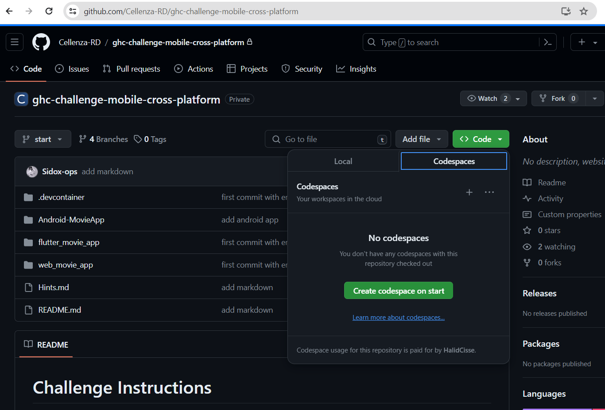
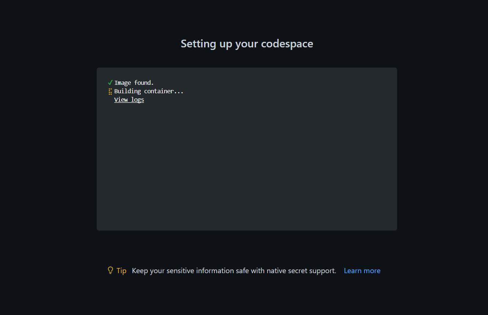
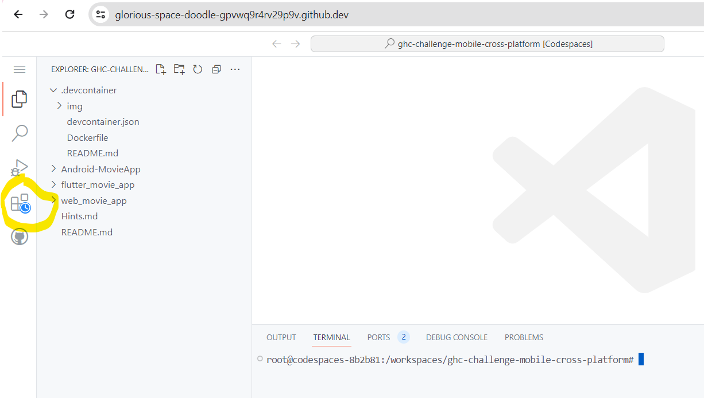
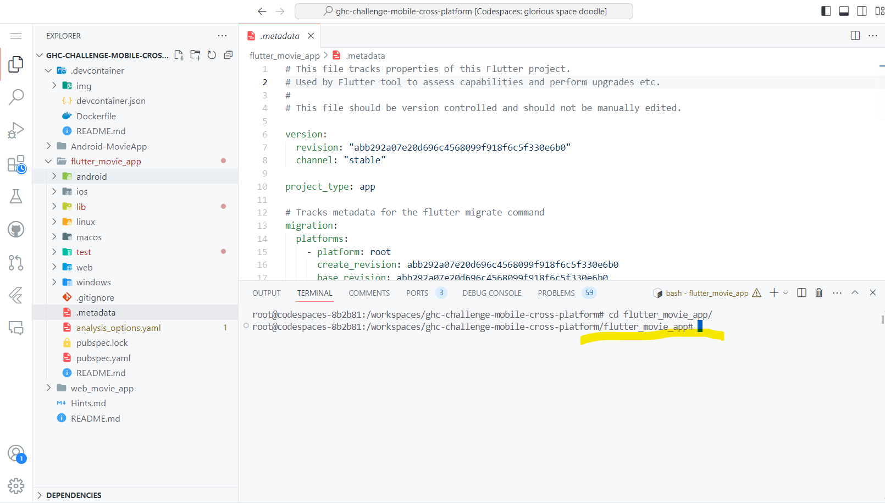
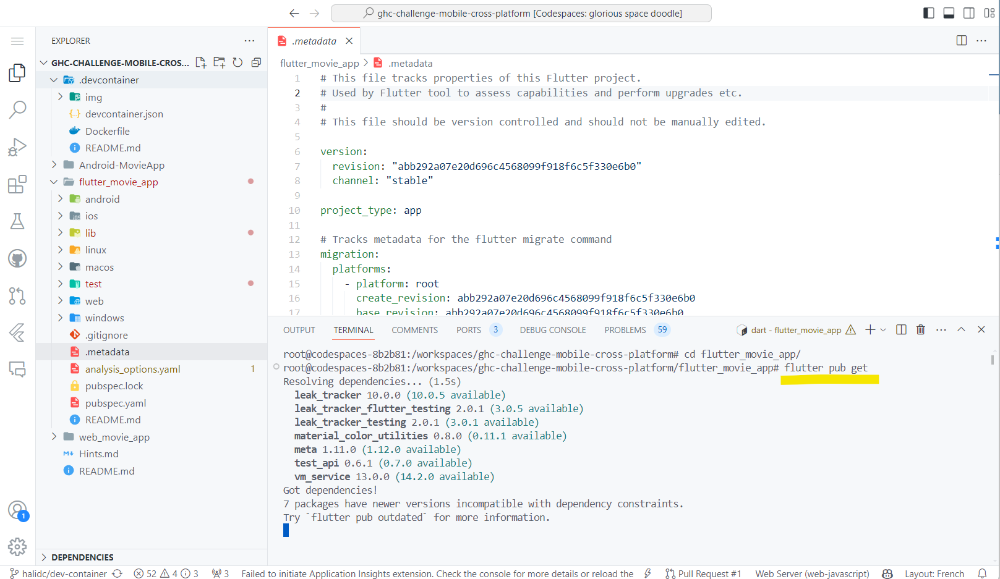
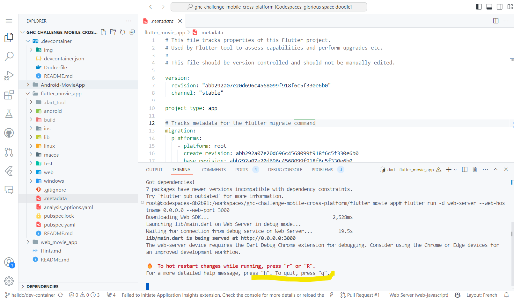
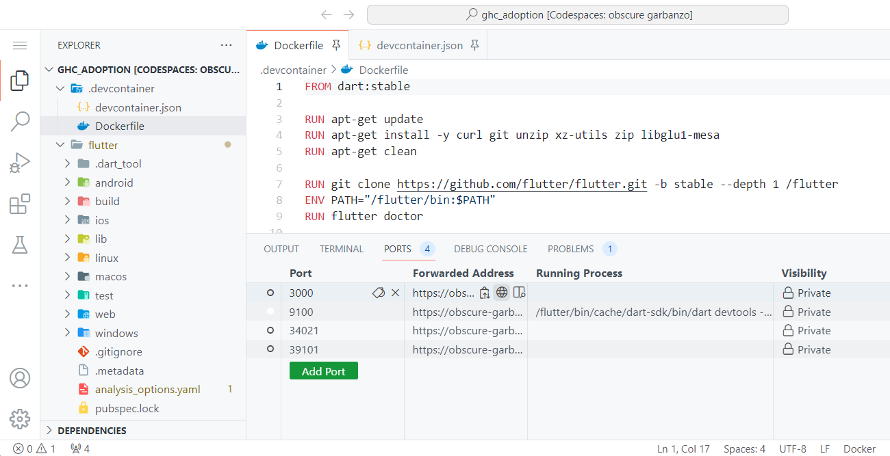
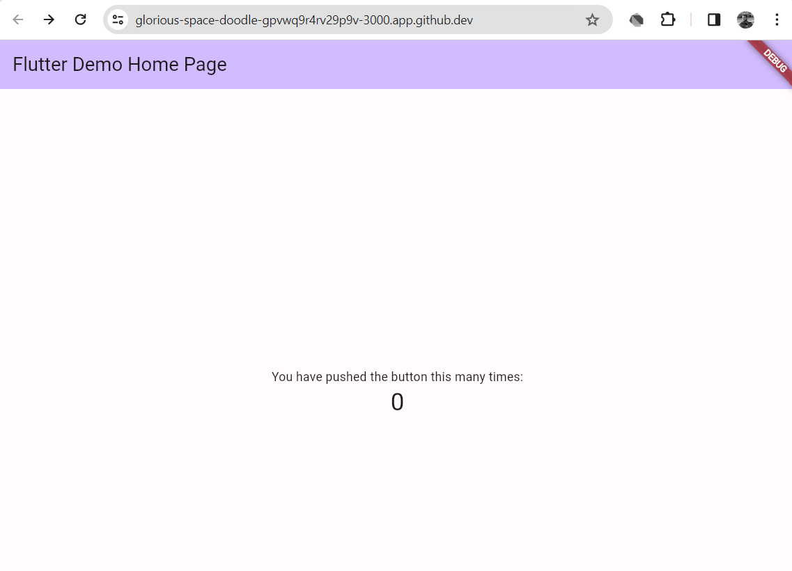

# Using this project on Codespaces

This repository is meant to be used with Visual Studio Codespaces and GitHub Codespaces. It contains a dev container configuration that will automatically set up a development environment for you.

## Getting Started

1. Open this repository in GitHub Codespaces or Visual Studio Codespaces.

    <https://github.com/Cellenza-RD/ghc-challenge-mobile-cross-platform>

    

2. The dev container will automatically start building and setting up your development environment that should look like this:

    

    Wait for around 5 minutes for the dev container to be ready.

3. Once the dev container is ready, wait for codespaces to finish installing extensions.

    

## Development

1. Open a terminal and run

    ```bash
    cd flutter_movie_app
    ```

    to change the project directory.

    

2. In the terminal run

    ```bash
    flutter pub get
    ```

    to install the flutter dependencies.

    

3. Run

    ```bash
    flutter run -d web-server --web-hostname 0.0.0.0 --web-port 3000
    ```

    to start the application.

    

4. On the bottom of the screen, click on the `PORTS` "Open in Browser" button to open the application in a new browser tab.

    

5. You can now start developing your application.

    
