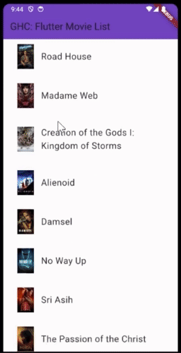

# Challenge Instructions

## Part 1: Create a cross-platform app using Flutter (40min)

In this part, create an app containing a movie catalog using Flutter. For that, you have a template app in Android, iOS, and web.

__For this part you are asked to use `flutter\lib\data\movies.json` as the moovie app data base.__

Target to reach

Follow these steps to complete this part of the challenge:

1. Look up the Android, iOS, and WebApp for some inspiration.
2. Translate the necessary code and assets from the templates app to the Flutter project.

>For this step you can use two approaches :
>- Prompt a visual description
> `How can I add display a list of movies in the Flutter Movie App using flutter\lib\data\movies.json as an input ?`
>- Use Android / iOS / Web inputs as template
> `#file Web-MovieApp\index.html translate this in a flutter file`

3. Test the Flutter app and ensure it runs correctly.

_Note: If after 40 minutes Part 1 is not completed, you are asked to commit your changes and checkout the branch `XXX` to proceed with Part 2._

## Part 2: Adding New Features or Connecting to an Open API (20min)

For the second part of the challenge, you have two options:

### Option 1: Adding New Features on the UI

If you choose this option, you will be adding new features to the user interface of the Flutter app. Here are some ideas for new features you can implement:

- Implement a search functionality to search for movies.

> You can simply prompt the instruction but you need to have the flutter file open. Prompt: `Implement a search functionality to search for movies`

- Switch from scrolling function to a carousel

> You can simply prompt the instruction but you need to have the flutter file open. Prompt: `Switch from scrolling function to a carousel`

Target to reach

### Option 2: Connecting to an Open API

If you choose this option, you will be connecting the Flutter app to an open API to expand the list of movies available in the app. Follow these steps to complete this option:

1. Integrate the [API](https://api.themoviedb.org/3/discover/movie?sort_by=popularity.desc&api_key=1cf50e6248dc270629e802686245c2c8) into the Flutter app and fetch movie data.
2. Display the fetched movie data in the app's UI.
3. Implement pagination or infinite scrolling to handle large amounts of movie data.

> Prompt example: How can I connect the flutter moovie app the public API https://api.themoviedb.org/3/discover/movie?sort_by=popularity.desc&api_key=1cf50e6248dc270629e802686245c2c8 Instead instead of `flutter\lib\data\movies.json`

Target to reach

Choose either option based on your preference and skillset. Feel free to combine both options if you want to challenge yourself further.

### Good luck and happy coding!
