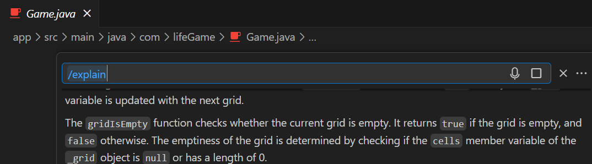
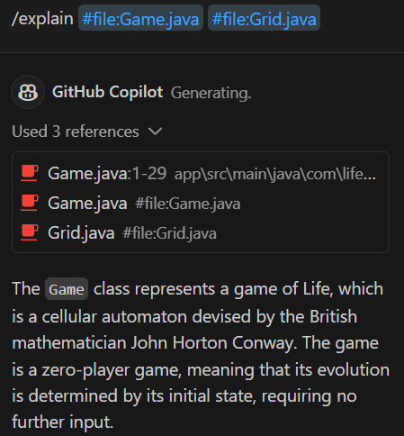

[Version française disponible plus bas](#version-française)

# Challenge instructions for `/explain` command
## Step 1: On the main file
### Instructions

1. Open the `Game.java` file.
2. Press `alt + :`.
3. Type `/explain` and press enter.

### Observations

To notice:
1. Copilot described the entire class.
2. You can have access to the references used in the input prompt. Notice that only the open file was used.
3. Check the explanations and see if they fit with the code you are reading.

## Step 2: On multiple files
### Instructions

*Open a new chat.*

You can ask Copilot to take further files into account using `#` inside the chat.

### Observations

To notice:
1. This time only the specified file was taken into account.
2. Compare the result with the previous answer which used only `Game.java`.

## Step 3: On code section exclusively
### Instructions
*Open a new chat.*
1. Open the file `Grid.java`.
2. Explain the expression in `isEmpty` method
3. `#File:Grid.java:12` to only consider line 31
4. Select the method ``isFull`` and type `/explain`

### Observations

You can select all the class, a specific method or a specific line to explain

# Version française

# Instructions de défi pour la commande `/explain`

## Étape 1 : Sur le fichier principal
### Instructions

1. Ouvrez le fichier `Game.java`.
2. Appuyez sur `alt + :`.
3. Tapez `/explain` et appuyez sur Entrée.

### Observations

À noter :
1. Copilot a décrit toute la classe.
2. Vous pouvez accéder aux références utilisées dans l'invite de commande. Notez que seul le fichier ouvert a été utilisé.
3. Vérifiez les explications et voyez si elles correspondent au code que vous lisez.

## Étape 2 : Sur plusieurs fichiers
### Instructions

*Ouvrez un nouveau chat.*

Vous pouvez demander à Copilot de prendre en compte d'autres fichiers en utilisant `#` dans le chat.

### Observations

À noter :
1. Cette fois, seul le fichier spécifié a été pris en compte.
2. Comparez le résultat avec la réponse précédente qui n'utilisait que `Game.java`.

## Étape 3 : Exclusivement sur une section de code
### Instructions
*Ouvrez un nouveau chat.*
1. Ouvrez le fichier `Grid.java`.
2. Expliquez l'expression dans la méthode `isEmpty`
3. `#File:Grid.java:12` pour ne considérer que la ligne 12
4. Sélectionnez la méthode ``isFull`` et tapez `/explain`

### Observations

Vous pouvez sélectionner toute la classe, une méthode spécifique ou une ligne spécifique à expliquer