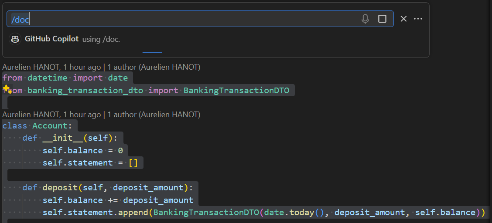
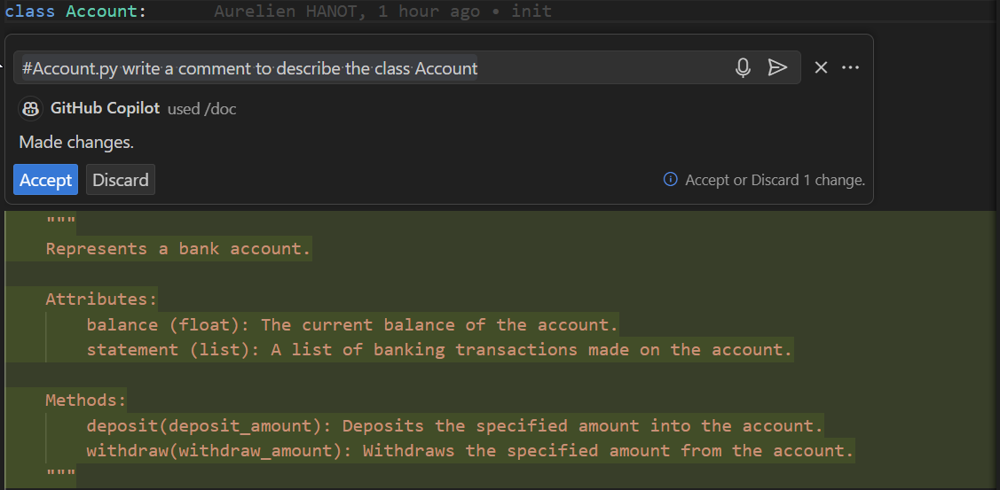
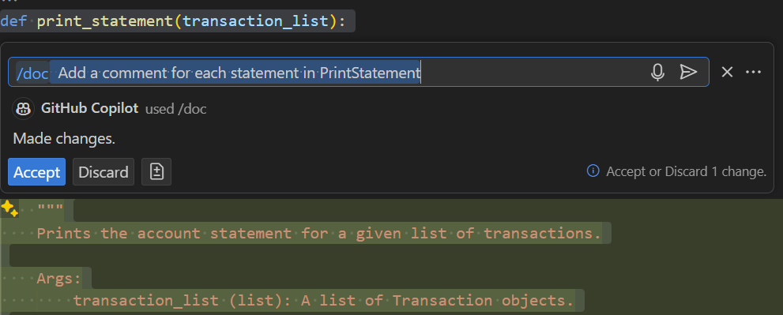

# Challenge instructions for `/doc` command

## Step 1: Add comments to the class

1. Open the `Account.py` file.
2. Use CTRL+A to select all the content in the file.
3. Press `ctrl+i` and type `/doc` to add comments.

4. Select only the class name in `BankingTransactionDTO.py`.
5. Type `/doc` to add comments.

### Observations

Comments are created for all the methods of the class.

There is not always a comment at the top of the class name.
There should not be a comment on Account.py.

## Step 2: Use Copilot Chat to generate a complete comment for the class name

1. Open Copilot Chat to generate a comment at the top of the class.
2. `#Account.py write a comment to describe the class Account`.
3. Ask for a shorter or longer comment.

### Observations

You can generate a complete comment and then modify it.
Copilot uses the context of the previous question.

## Step 3: Add comments to a test method

1. Open the `AccountTest.py` file.
2. Select the method `WhenAWithdrawAfterDepositIsDone_BankAccountShouldBeEqualToDepositMinusWithDrawAndStatementUpdated` and type `/doc`.
3. Rename the method to `WhenAWithdrawAfterDepositIsDone_BankAccountShouldBeUpdated` and type `/doc`.

### Observations

Comments are generated using the method name.

Your code needs to be descriptive to generate good comments.

## Step 4: Add comments inside a method

Open ``AccountStatementPrint.py`` and type the following command: `/doc Add a comment for each statement in PrintStatement`

### Observations

You can generate documentation inside complex methods.

## Step 5: Create a README.md

1. In Visual Studio Code, create a file named README.md at the root of the project.
2. Type in Copilot Chat `Create a template for README.md`.
3. Add details to the comment with `Create a template for README.md for a python project`.
4. Accept the template and open Github Copilot Chat.
5. Type `@workspace Create a brief description for the Banking Kata project`.

### Observations

You can generate overall documentation for a project.

## Step 6: Improve your documentation

1. Ask Github Copilot to improve your README.md file.
2. `What should I include in the README.md file for a python project?`

### Observations

Github Copilot suggests additional sections.