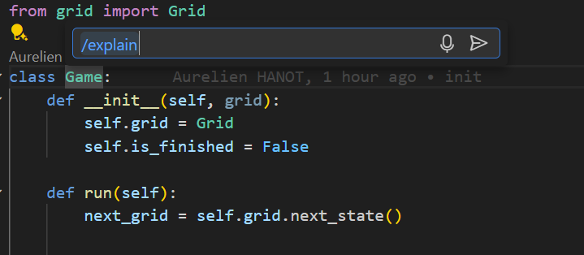
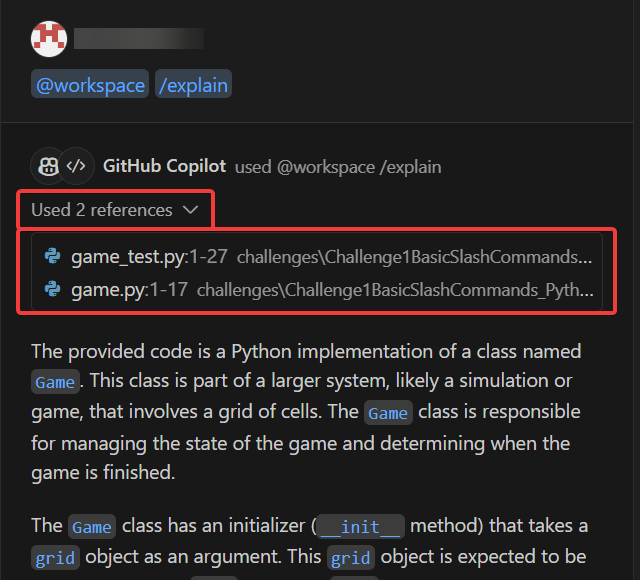
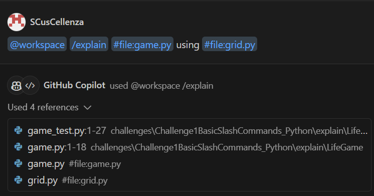
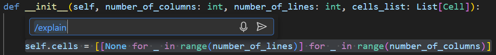
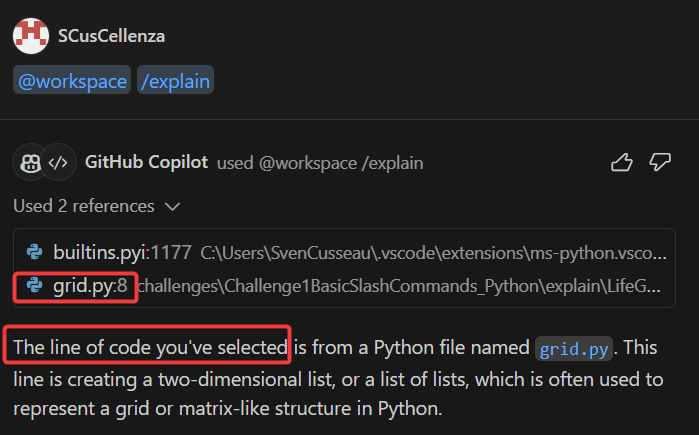

# Challenge instructions for `/explain` command
## Step 1: On the main file
### Instructions

1. Open the `game.py` file : make sure it is the ONLY file open
2. Press `ctrl+i`.
3. Type `/explain` and press enter.

### Observations

1. Copilot described the entire class and used the command `@workspace`
2. You can have access to the references used in the input prompt. Notice that not only the opened file was used.
3. Check the explanations and see if they fit with the code you are reading.

## Step 2: On multiple files
### Instructions

*Open the chat on the left sidebar.*

You can ask Copilot to take specific files into account using `#` inside the chat.

### Observations
1. This time only the specified file was taken into account.
2. Compare the result with the previous answer which used only `game.py`.

## Step 3: On code section exclusively
### Instructions
*Open a new chat.*
1. Open the file `grid.py`.
2. Select the line 8 containing a lambda expression.
3. Press `ctrl+i` and enter `/explain`

### Observations

Line 8 was taken into account and explained instead of the whole file.