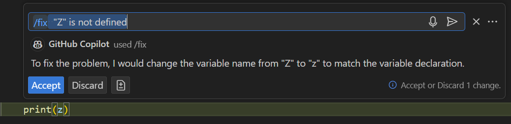
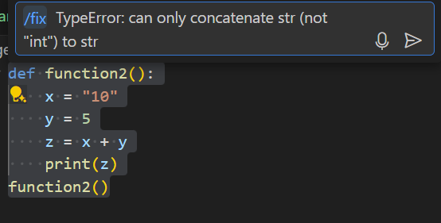
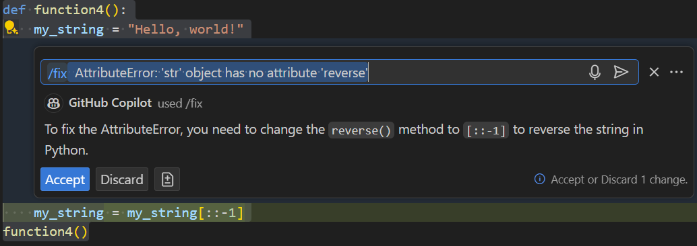
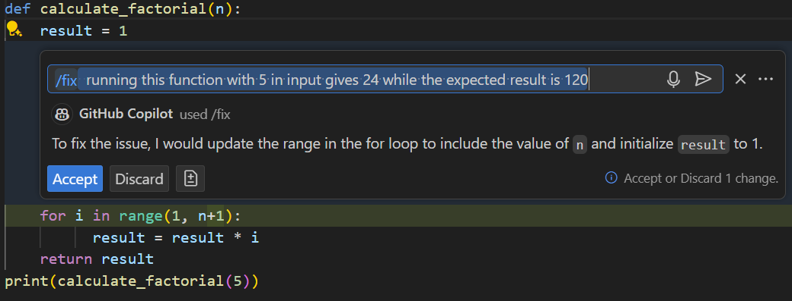

# Challenge instructions for `/fix` command

## Step 1 : Name error

1. Open file `FixExample1.py`
2. Put you cursor on the error and enter `ctrl + i` to open copilot

3. If it's proposed click on `fix "Z" is not defined` or enter `/fix`
4. Copilot should propose this correction

## Step 2 : Type Error
1. Open file `FixExample2.py` and run the code
2. A ``TypeError`` should be displayed in the terminal
3. Copy the error message
4. Select the code and ask copilot (using `ctrl+i`) to fix the issue

## Step 3 : Index Error
1. Open file `FixExample3.py` and run the code
2. A ``IndexError`` should be displayed in the terminal
3. Copy the error message
4. Select the code and ask copilot (using `ctrl+i`) to fix the issue

## Step 4 : Attribute Error
1. Open file `FixExample4.py` and run the code
2. A ``AttributeError`` should be displayed in the terminal
3. Copy the error message
4. Select the code and ask copilot (using `ctrl+i`) to fix the issue

## Step 5 : Logical error

1. Open file `FixExample5.py` and run the code
2. `24` is printed while the factorial of 5 is 120. We face a ``logical error``
3. Select the code and ask copilot (using `ctrl+i`) to fix the issue

