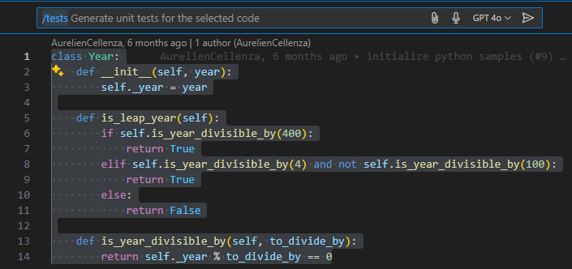
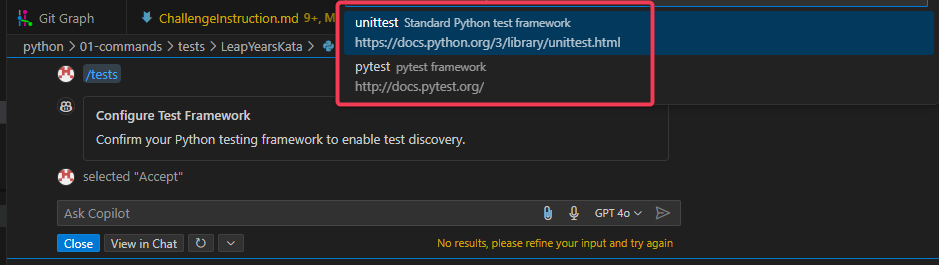
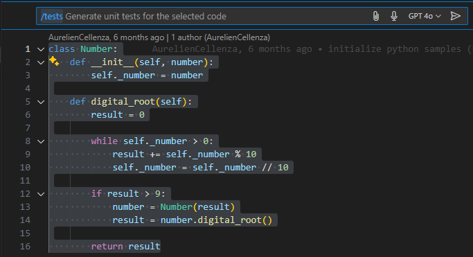
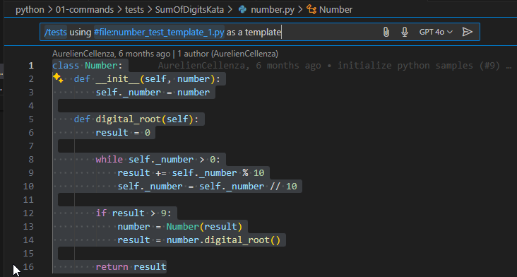
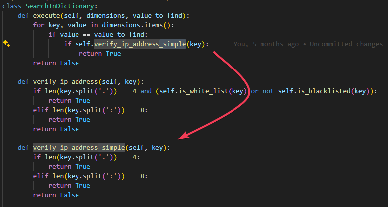

# Challenge instructions for `/tests` command

[Version française disponible plus bas](#instructions-en-français)

## Step 1: Generate tests for `year.py`

### Instructions

1. Open the `year.py` file in the folder `LeapYearsKata`.
2. In VS Code, press `ctrl + i` with the cursor on the class name.
3. Type `/tests` and press enter.

### Observations

To note:

1. Copilot should ask you for the testing framework to use and further configuration if you never did before.
2. It proposes to write the answer in a new file.
3. Check the generated tests and see if they fit with the code you are reading.

## Step 2: Generate tests for `number.py`

### Instructions

1. Open the `number.py` file in the folder `SumOfDigitsKata`.
2. In VS Code, press `ctrl + i` with the cursor on the class name.
3. Type `/tests` and press enter.

### Observations

To note:

1. It proposes to write the answer in a new file.
2. Check the generated tests and see if they fit with the code you are reading.

## Step 3: Generate tests for `number.py` using a template

### Instructions
*Open a new chat*

1. Open the `number.py` file in the folder `SumOfDigitsKata`.
2. In VS Code, press `ctrl + i` with the cursor on the class name.
3. Type `/tests` and specify that you want to use the file `number_test_template_1.py` as a template.

### Observations
1. The proposed results should be different from step 2.
2. Redo the same experiment but with `number_test_template_2.py` open and check the response difference.

*Note: Copilot is good at replicating templates. Giving it examples to work on improves the output quality.*

## Step 4: Generate tests in ComplexMethod project

### Instructions

Here is the modified version using Python files:

1. Generate a test for the execute method in search_in_dictionary.py.
2. Save this test as search_in_dictionary_tests_step1.py.

3. Replace the verify_ip_address call in execute with verify_ip_address_simple.

4. Regenerate the test for execute in search_in_dictionary.py.

5. Compare search_in_dictionary_tests_step1.py with the new result.

### Observations

1. There is a limit of number of tests that can be generated
2. You need small methods to generate efficient tests with Copilot 
3. With many nested methods, you can't generate all unit tests

# Instructions en français

## Étape 1 : Générer des tests pour `year.py`

### Instructions

1. Ouvrez le fichier `year.py` dans le dossier `LeapYearsKata`.
2. Dans VS Code, appuyez sur `ctrl + i` avec le curseur sur le nom de la classe.
3. Tapez `/tests` et appuyez sur Entrée.

### Observations

À noter :

1. Copilot devrait vous demander le framework de test à utiliser et d'autres configurations si vous ne l'avez jamais fait auparavant.
2. Il propose d'écrire la réponse dans un nouveau fichier.
3. Vérifiez les tests générés et voyez s'ils correspondent au code que vous lisez.

## Étape 2 : Générer des tests pour `number.py`

### Instructions

1. Ouvrez le fichier `number.py` dans le dossier `SumOfDigitsKata`.
2. Dans VS Code, appuyez sur `ctrl + i` avec le curseur sur le nom de la classe.
3. Tapez `/tests` et appuyez sur Entrée.

### Observations

À noter :

1. Il propose d'écrire la réponse dans un nouveau fichier.
2. Vérifiez les tests générés et voyez s'ils correspondent au code que vous lisez.

## Étape 3 : Générer des tests pour `number.py` en utilisant un modèle

### Instructions
*Ouvrez un nouveau chat*

1. Ouvrez le fichier `number.py` dans le dossier `SumOfDigitsKata`.
2. Dans VS Code, appuyez sur `ctrl + i` avec le curseur sur le nom de la classe.
3. Tapez `/tests` et spécifiez que vous souhaitez utiliser le fichier `number_test_template_1.py` comme modèle.

### Observations
1. Les résultats proposés devraient être différents de l'étape 2.
2. Refaites la même expérience mais avec `number_test_template_2.py` ouvert et vérifiez la différence de réponse.

*Remarque : Copilot est bon pour reproduire des modèles. Lui donner des exemples sur lesquels travailler améliore la qualité de la sortie.*

## Étape 4 : Générer des tests dans le projet ComplexMethod

### Instructions

Voici la version modifiée utilisant des fichiers Python :

1. Générez un test pour la méthode execute dans search_in_dictionary.py.
2. Enregistrez ce test sous search_in_dictionary_tests_step1.py.

3. Remplacez l'appel verify_ip_address dans execute par verify_ip_address_simple.

4. Régénérez le test pour execute dans search_in_dictionary.py.

5. Comparez search_in_dictionary_tests_step1.py avec le nouveau résultat.

### Observations

1. Il y a une limite au nombre de tests qui peuvent être générés
2. Vous avez besoin de petites méthodes pour générer des tests efficaces avec Copilot 
3. Avec de nombreuses méthodes imbriquées, vous ne pouvez pas générer tous les tests unitaires